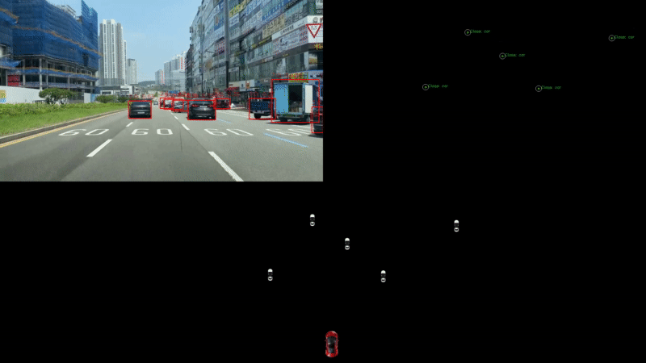
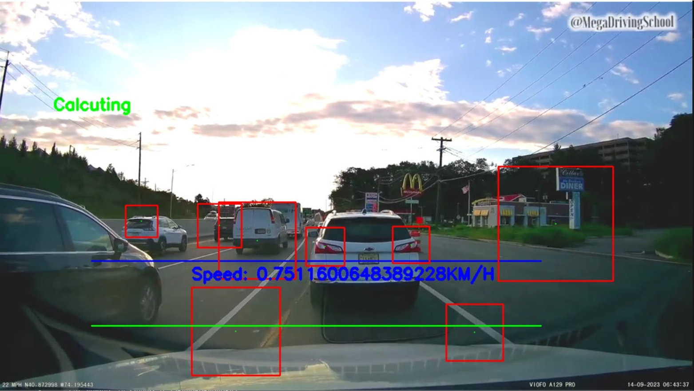
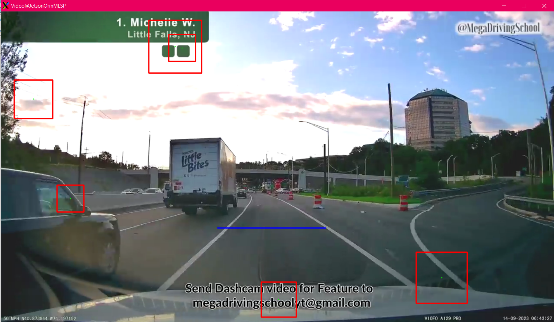
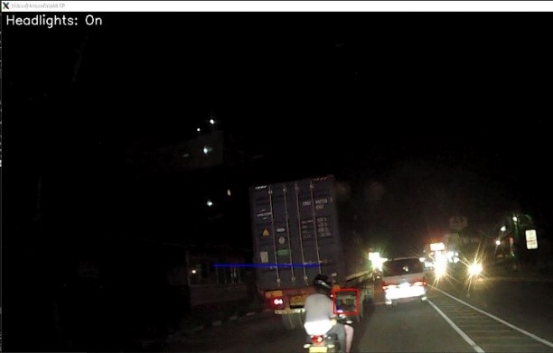

# Driver Assistance System with YOLOv5 and Jetson Orin

This project develops a real-time driver assistance system deployed on an NVIDIA Jetson board. It leverages the YOLOv5 deep learning model for object detection, enhancing driver awareness and safety on the road.



### Key functionalities include:

 - ### Speed Limit Recognition and Assist :
   Accurately detects speed limit signs and alerts drivers when exceeding the posted limit.
   
 - ### Forward Collision Warning:
   Continuously monitors the environment, identifying potential collisions and providing timely warnings to prevent accidents.
   
 - ### Adaptive Headlight Control:
   Automatically adjusts headlights based on ambient light conditions and detected vehicles, improving visibility for both the driver and oncoming traffic.
   
   

### Features

- Real-time object detection using the YOLOv5 model.
- Detection of various objects relevant to ADAS, such as vehicles, pedestrians, cyclists, and traffic signs.
- Object tracking to maintain continuity and trajectory of detected objects.
- Bird's Eye View (BEV) visualization of the detected objects in a simulated environment.
- Customizable confidence threshold and class filtering.
- Simulated environment provides an intuitive top-down view of object positions and movements.
- Supports both image and video input for object detection and tracking.
- Easy integration with pre-trained YOLOv5 models.
- Provides bounding box coordinates, class labels, and tracking IDs for detected objects.

### Prerequisites

- Python 3.x
- OpenCV
- PyTorch
- NumPy

### Installation

1. Clone this repository.
2. Install the required dependencies

```bash
pip3 install torch opencv numpy
```

### Usage

1. Download pre-trained YOLOv5 weights or train your own model.
2. Provide the path to the YOLOv5 weights in the code.
3. Run the script with the video file.
4. View the object detection results and Bird's Eye View visualization.

For more detailed usage instructions and options, refer to the project documentation.

### Run

```bash
python3 yoloV5_sim.py
```

### Contributing

Contributions are welcome! If you find any issues or have suggestions for improvements, please open an issue or submit a pull request.

### License

This project is licensed under the MIT License. See the `LICENSE` file for details.

### Acknowledgments

- YOLOv5: [https://github.com/ultralytics/yolov5](https://github.com/ultralytics/yolov5)
- OpenCV: [https://opencv.org/](https://opencv.org/) 


